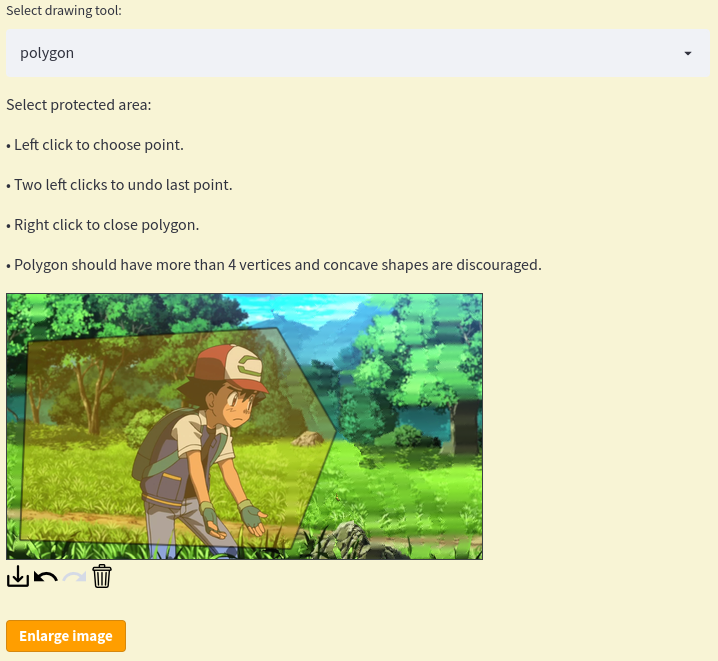

 <up>2 min read 
# Image resizer using seam carving
- Have you ever been frustated when your favorite family picture or another wallpaper does not fit on your screen?
- Have you tried to resize your image but it just scales up/down everything making the objects in the picture look peculiar?
- Have you ever wanted to remove an unwanted item from an image and make it disappear as if it was never there?

If you answer yes to any of the questions above, you are on the right place. This project provides a [web application](https://share.streamlit.io/ngocuong0105/imageresizer/app.py) for image resizing with content awareness. It achieves resizing an image without cropping it or distorting its contents. Indeed, successful compression and enlargement of images should not take into account only  geometric constraints, but consider the image content as well. Inspired by this [youtube video](http://www.youtube.com/watch?v=vIFCV2spKtg) and [Avidan and Shamir](http://graphics.cs.cmu.edu/courses/15-463/2007_fall/hw/proj2/imret.pdf) paper, we use seam carving to resize images while protecting sensitive parts of the image such as objects. We achieve content-aware resizing by smartly picking which pixels to be removed or multiplied. **Rather than doing a simple scaling where all pixels are just averaged over neighbours or copied, here we use dynamic programming to determine the "best" pixels to remove.** Best pixels are chosen using either [Sobel](https://en.wikipedia.org/wiki/Sobel_operator) or [Scharr](https://en.wikipedia.org/wiki/Sobel_operator) gradient operators which  compute energy maps of the image.  
The app supports image compression, enlargement and object removal which is a combination of the previous two. Below you can see sample results produced by my [image resizer](https://share.streamlit.io/ngocuong0105/imageresizer/app.py) app. These results are compared with a generic [image editor](https://resizeimage.net/), which is one of the top results in google search.

------------------------------------------------------------------------------------
## Object removal
**Vase bye bye!**  

**Original image**  

**Vase removed**  

------------------------------------------------------------------------------------
## Image enlargement

**Protect Charmander!**  

**Original image** 

**Generic image enalrgement with scaling using first [google result](https://resizeimage.net/)**  

**Image enlargement with content awareness**  

------------------------------------------------------------------------------------
## Image compression

**The ship shall not sink!**  

**Original image**  

**Generic compression with scaling using first [google result](https://resizeimage.net/)**  

**Image compression with content protection**  

------------------------------------------------------------------------------------
## How to use [image resizer](https://share.streamlit.io/ngocuong0105/imageresizer/app.py) in 2 minutes?

**Object removal example: Where is Pikachu?**  

1. Open [image resizer](https://share.streamlit.io/ngocuong0105/imageresizer/app.py) and click Start to load resizing page.
2. Upload image you want to resize.
3. Choose Image compression with object removal.  

4. On the canvas draw around the area you want to remove (Bye Pikachu)

5. Click resize and wait.  

6. Download image and then upload it again to enlarge back to initial size.  

7. Enlarge image with protection (protect Ash).  

8. Download final result.  

See 2 minutes video of these steps. Turn on subtitles to follow instructions:

**Final example: [ImageReziser](https://share.streamlit.io/ngocuong0105/imageresizer/app.py) helps you to ged rid of your ex in the most optimal way!** 
