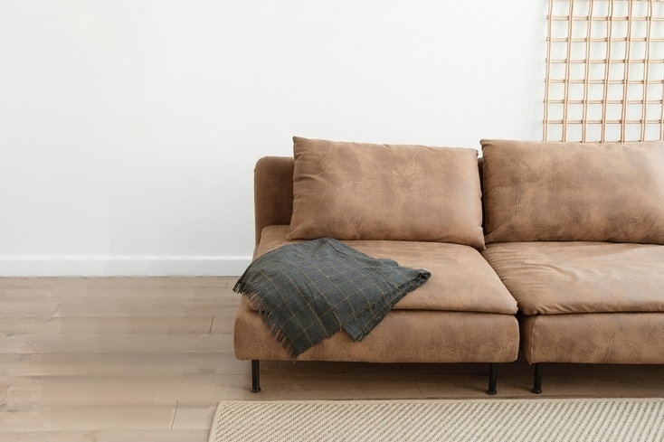

# Image resizer using seam carving
- Have you ever been frustated when your favorite family picture or another wallpaper does not fit on your screen?
- Have you tried to resize the image but it just scales up/down everything making the objects in the picture odd?
- Have you ever wanted to remove an unwanted item from an image?

If you answer yes to any of the questions above, you are on the right place. This project provides a [web application]() for image resizing with content awareness. Successful compression and enlargement of images should not only use geometric constraints, but consider the image content as well. Inspired by this [youtube video](http://www.youtube.com/watch?v=vIFCV2spKtg) and [Avidan and Shamir](http://graphics.cs.cmu.edu/courses/15-463/2007_fall/hw/proj2/imret.pdf) paper, we use seam carving to resize images while protecting sensitive parts of the image such as objects.
We achieve content-aware resizing by removing pixels in a judicious manner. **Rather doing a simple scaling where every pixel is just multiplied and copied over, here we use dynaic programming to determine the "best" pixels to remove.**
The app supports image compression, enlargement and object removal which is combination of the previous two. You can see sample results below. They are all produced by my [image resizer]() app.

------------------------------------------------------------------------------------
## Object removal
### Vase bye bye!

### Original image

### Vase removed

------------------------------------------------------------------------------------
## Image enlargement

### Protect Charmander!

### Original image
<!--  -->

### Generic image enalrgement with scaling using first [google result](https://resizeimage.net/)

### Image enlargement with content awareness

------------------------------------------------------------------------------------
## Image compression

### The ship shall not sink!

### Original image

### Generic compression with scaling using first [google result](https://resizeimage.net/) 

### Image compression with content protection

